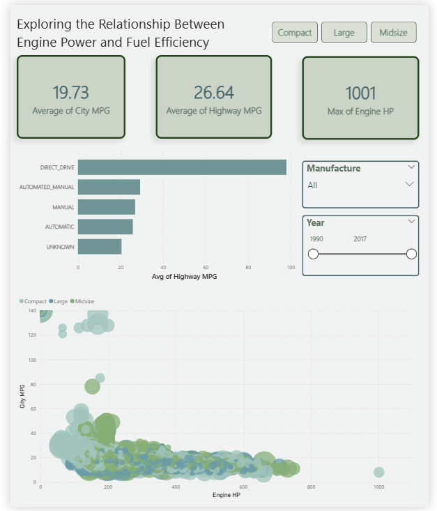

# Exploring the Relationship Between Engine Power and Fuel Efficiency

## Overview
This project presents an interactive Power BI dashboard that explores how engine horsepower relates to fuel efficiency (City MPG and Highway MPG) across different vehicle classes, manufacturers, and production years.

The goal of this dashboard is to understand performance–efficiency trade-offs and demonstrate practical Power BI dashboarding skills.

---

## Scope of This Project
This dashboard is intentionally kept simple and focuses on Power BI visualization, layout, and interactivity. Advanced Power BI concepts such as complex DAX calculations and data modeling are demonstrated in other dashboards within my portfolio.

---

## Dashboard Features
- KPI cards showing:
  - Average City MPG
  - Average Highway MPG
  - Maximum Engine Horsepower
- Interactive slicers for:
  - Vehicle class (Compact, Midsize, Large)
  - Manufacturer
  - Year range
- Scatter plot visualizing:
  - Engine Horsepower vs City MPG
- Bar chart comparing:
  - Average Highway MPG by transmission type

---

## Key Insights
- Vehicles with higher engine horsepower generally show lower fuel efficiency.
- Compact vehicles tend to achieve better City and Highway MPG than larger vehicle classes.
- Transmission type plays a noticeable role in highway fuel efficiency.

---

## Skills Demonstrated
- Power BI dashboard design and layout
- Data modeling and aggregation
- DAX measures (averages, maximums)
- Interactive slicers and cross-filtering
- Visual storytelling and insight extraction

---

## Tools & Technologies
- Power BI Desktop
- DAX
- Data visualization best practices

---

## Preview

### Dashboard Overview

